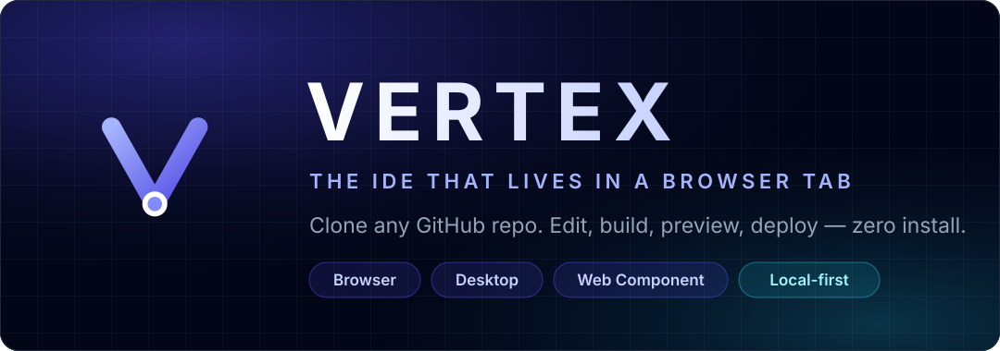
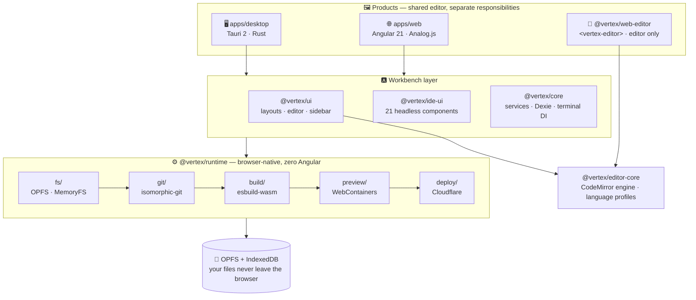
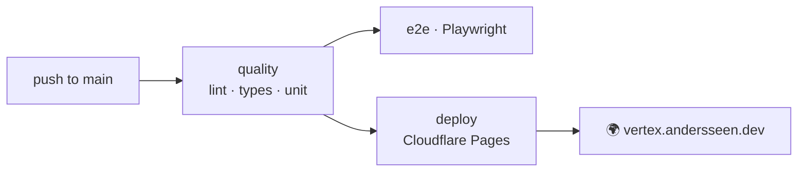

<div align="center">

<picture>
  <source media="(prefers-color-scheme: dark)" srcset="docs/assets/banner-dark.svg">
  <source media="(prefers-color-scheme: light)" srcset="docs/assets/banner-light.svg">
  
</picture>

<br/>
<br/>

### Clone any GitHub repo, edit it, build it, preview it, ship it — **without installing anything.**

**Vertex is an open-source family of code-editing products.** The browser
workbench combines Git, a virtual filesystem, build, and a Node-compatible
runtime client-side. The Tauri app adds installed-platform adapters, while the
drop-in `<vertex-editor>` remains a focused editor with no IDE/runtime
dependency.

<br/>

[](https://github.com/Andersseen/vertex/actions/workflows/ci.yml)
[](https://vertex.andersseen.dev)
[](LICENSE)
[](https://github.com/Andersseen/vertex/stargazers)

[](https://angular.dev)
[](https://bun.sh)
[](https://tauri.app)
[](https://www.rust-lang.org)
[](https://www.typescriptlang.org)
[](https://analogjs.org)
[](docs/DEPLOYMENT.md)

<br/>

[**🚀 Try it live**](https://vertex.andersseen.dev) · [**⚡ Quick start**](#-quick-start) · [**🧩 Products**](#-product-surfaces) · [**🏗️ Architecture**](#️-architecture) · [**📦 Web component**](#-embed-the-editor-anywhere) · [**📚 Docs source**](apps/docs/README.md) · [**🤝 Contributing**](CONTRIBUTING.md)

</div>

---

## 💡 The idea

Cloud IDEs put your code on someone else's machine. Local IDEs need an install, a runtime, a toolchain.
**Vertex takes the third path: the browser *is* the machine.**

```
     paste a repo URL  →  git clone (in-browser)  →  edit  →  bundle  →  preview  →  deploy
                              isomorphic-git          CodeMirror 6   esbuild-wasm   WebContainers   Cloudflare
```

The hosted browser workbench does not require a Vertex application backend. It
is static output on Cloudflare Pages; repositories are cloned into browser
storage rather than uploaded to a Vertex server. Optional local sidecars exist
for installed/native development workflows.

---

## 🧭 Product surfaces

Vertex is not one application stretched across every environment:

| Surface | Job | Owns |
| :-- | :-- | :-- |
| `apps/web` | Complete browser workbench | OPFS, browser Git, build, WebContainer preview, deploy |
| `apps/desktop` | Installed Tauri workbench | Native filesystem/process/terminal adapters and lifecycle |
| `<vertex-editor>` | Editor embedded in another product | Editing API, language loading, themes, events |
| `<vertex-editor-lite>` | Read-only code display | Small native custom element and syntax highlighting |

The custom elements do not include filesystems, Git, terminals, preview, or
deployment. Preview is a workbench capability, not an editor capability.

---

## ✨ What you get

<table>
<tr>
<td width="33%" valign="top">

### 🌿 Real git, in the tab
`isomorphic-git` over a virtual FS. Clone, stage, commit, branch — against any public repo.

</td>
<td width="33%" valign="top">

### 💾 Storage that survives
**OPFS + IndexedDB** via Lightning FS. Close the tab, come back, your working tree is still there.

</td>
<td width="33%" valign="top">

### ⌨️ A real editor
CodeMirror 6 with TS/JS, HTML, CSS, JSON, Markdown, Python and Rust modes, lint and autocomplete.

</td>
</tr>
<tr>
<td valign="top">

### 📟 Terminal
xterm.js with a pluggable backend — WebContainers in the browser, `node-pty` on the desktop.

</td>
<td valign="top">

### 📦 Build & preview
`esbuild-wasm` bundles in-browser; WebContainers boot a Node runtime and serve a live preview.

</td>
<td valign="top">

### ☁️ Ship from the IDE
Cloudflare Pages **and** Workers adapters live inside `@vertex/runtime` — build, then publish.

</td>
</tr>
<tr>
<td valign="top">

### 🖥️ Desktop too
The same Angular app inside **Tauri 2**, with a Rust bridge for native filesystem access.

</td>
<td valign="top">

### 🧩 21 IDE components
`@vertex/ide-ui` — splitters, trees, tabs, toasts, virtual lists — headless logic, CSS-var theming.

</td>
<td valign="top">

### ⚡ Zoneless Angular 21
Signals everywhere, `OnPush` everywhere, no Zone.js, no Tailwind, no component framework.

</td>
</tr>
</table>

---

## 🚀 Try it live

<div align="center">

**[vertex.andersseen.dev](https://vertex.andersseen.dev)** — paste a repo URL, hit *Clone & Edit*.

</div>

```text
1.  Open  https://vertex.andersseen.dev
2.  Paste https://github.com/andersseen/palette-forge   (or any public repo)
3.  Clone & Edit — the repo is cloned into your browser, not onto a server
```

---

## ⚡ Quick start

> **Requirements** — [Bun](https://bun.sh) `1.3.11+`, Node.js `22.12+`, and a Rust toolchain *(desktop only)*.

```bash
git clone https://github.com/Andersseen/vertex.git
cd vertex
bun install
bun web:dev            # → http://localhost:5173
```

<details>
<summary><b>All the commands you'll actually need</b></summary>

<br/>

| | Command | What it does |
| :-- | :-- | :-- |
| 🌐 | `bun web:dev` | Vite dev server for the web IDE → `localhost:5173` |
| 🖥️ | `bun desktop:dev` | Tauri desktop app (needs Rust) |
| 🔗 | `bun dev:all` | Web app + terminal sidecar + filesystem sidecar in parallel |
| 🧱 | `bun run build` | Full monorepo build through Turborepo |
| 🧹 | `bun lint` · `bun lint:fix` | ESLint across every workspace |
| 🔍 | `bun check-types` | `tsc --noEmit` across every workspace |
| 🧪 | `bun test` | Unit tests (Bun test runner) |
| 🎭 | `bun test:e2e` | Playwright end-to-end suite |
| 📦 | `bun web-editor:build` | Bundle the `<vertex-editor>` web component |
| 🎬 | `bun web-editor-demo:start` | Build the component and serve its demo app |
| 📚 | `bun docs:dev` · `bun docs:build` · `bun docs:deploy` | Develop, build, or publish the Starlight documentation |
| ☁️ | `bun run deploy` | Build + publish to Cloudflare Pages |

</details>

---

## 🏗️ Architecture



<details>
<summary><b>Monorepo layout</b></summary>

<br/>

```text
apps/
  web/                  🌐 Angular 21 + Analog.js + Vite — the main IDE
  desktop/              🖥️ Tauri 2 shell around the same app
  web-editor-demo/      🎬 Playground for the standalone web component
  docs/                 📚 Starlight documentation for every product surface
packages/
  frontend/
    core/               🧠 Angular services, Dexie DB, terminal adapter token
    editor-core/        ✏️ Framework-free CodeMirror engine and language profiles
    ide-ui/             🧩 @vertex/ide-ui — headless IDE components (CSS custom props)
    runtime/            ⚙️ VirtualFS · GitClient · Bundler · Preview · Deploy
    types/              📐 Shared TypeScript contracts
    ui/                 🎨 Layouts, CodeMirror editor, sidebar
    web-editor/         📦 Publishable <vertex-editor> Angular Element
  backend/
    sidecar/            🦀 Bun/Hono filesystem sidecar
    terminal/           📟 Node.js + node-pty terminal sidecar
    core/               🧪 Experimental shared terminal types
scripts/                🔧 Install & release helpers
docs/                   🧭 Repository architecture, deployment, and design notes
```

</details>

The products intentionally have different scopes. See
[`docs/ARCHITECTURE.md`](docs/ARCHITECTURE.md) for dependency rules and product
boundaries, and [`docs/EDITOR_FOUNDATION.md`](docs/EDITOR_FOUNDATION.md) for the
stability checklist.

<details>
<summary><b>Where state lives</b></summary>

<br/>

| Layer | Stores | Why |
| :-- | :-- | :-- |
| `localStorage` | Splitter positions | Synchronous read, no layout flash on boot |
| `sessionStorage` | Open tabs (`vertex:editor`) | Intentionally volatile |
| Dexie v4 (`vertex-ide`) | Active session, preferences | Structured and extensible |
| OPFS + IndexedDB | Cloned repository files | Browser-native filesystem, survives reloads |

</details>

---

## 📦 Embed the editor anywhere

Vertex ships its editor as a framework-agnostic custom element. Drop one script tag into
**any** page — React, Vue, Rails, plain HTML — and you have a CodeMirror-powered editor.

```bash
curl -fsSL https://raw.githubusercontent.com/Andersseen/vertex/main/scripts/install.mjs | node - ./public
```

```html
<script src="web-editor.min.js"></script>

<vertex-editor value="const x = 1;" language="typescript" theme="dark"></vertex-editor>
```

| Bundle | Element | Size | Use case |
| :-- | :-- | :-- | :-- |
| `web-editor.min.js` | `<vertex-editor>` | ~1.1 MB | Full editing, autocomplete, lint |
| `web-editor-lite.min.js` | `<vertex-editor-lite>` | ~450 KB | Read-only syntax-highlighted display |

📥 Always-fresh builds: [**`web-editor-latest`** release](https://github.com/Andersseen/vertex/releases/tag/web-editor-latest) ·
📖 [component docs](packages/frontend/web-editor/README.md)

---

## 🗺️ Status

Vertex is in active development. The current target is a dependable editor and
browser/tablet MVP, not VS Code feature parity.

| Priority | Current state |
| :-- | :-- |
| Shared editor core, language profiles, package boundaries | ✅ Established |
| Full and lite custom elements with enforced bundle budgets | ✅ Established |
| Public docs and canonical custom-element API | 🔄 In progress |
| Capability fallback, recovery UX, blocking persistence E2E | 🧭 Next |
| Project search, command palette, Git status/diff | 🧭 MVP |
| Physical tablet keyboard/touch/lifecycle validation | 🧭 MVP |
| Broad VS Code extension compatibility | 🔭 Later research |

See the [foundation checklist](docs/EDITOR_FOUNDATION.md) and the
[public roadmap source](apps/docs/src/content/docs/project/roadmap.md).

---

## ☁️ Deployment

**One platform, one pipeline, one command.** Cloudflare is the only deploy target — no Vercel,
no Netlify, no split brain between local and CI.



```bash
bun run deploy    # identical to what CI runs
```

Full details — secrets, environments, headers, the Workers migration path — in
📄 **[docs/DEPLOYMENT.md](docs/DEPLOYMENT.md)**.

---

## 🛠️ Under the hood

| Area | Choice |
| :-- | :-- |
| **Framework** | Angular 21, zoneless (`provideZonelessChangeDetection`), signals-first, `OnPush` everywhere |
| **Meta-framework** | Analog.js — file-based routing in `apps/web/src/app/routes/` |
| **Build** | Vite 8 · Turborepo · Bun workspaces |
| **Editor / terminal** | CodeMirror 6 · xterm.js |
| **In-browser runtime** | Lightning FS (OPFS) · isomorphic-git · esbuild-wasm · WebContainers |
| **Desktop** | Tauri 2 + Rust sidecar |
| **Styling** | Pure CSS custom properties (`--ide-*`). No Tailwind, no PrimeNG, no CSS-in-JS |
| **Headless logic** | [`quartz-headless`](https://www.npmjs.com/package/quartz-headless) · `@andersseen/headless-components` |

Conventions for contributors (and coding agents) live in **[AGENTS.md](AGENTS.md)**,
with Angular and Analog specifics in [ANGULAR_USAGE.md](ANGULAR_USAGE.md) and
[ANALOGJS_USAGE.md](ANALOGJS_USAGE.md).

---

## 📚 Documentation

| Doc | About |
| :-- | :-- |
| [AGENTS.md](AGENTS.md) | Architecture, conventions, commands — the authoritative guide |
| [apps/docs](apps/docs/README.md) | Public Starlight documentation application |
| [docs/ARCHITECTURE.md](docs/ARCHITECTURE.md) | Product ownership and package boundaries |
| [docs/EDITOR_FOUNDATION.md](docs/EDITOR_FOUNDATION.md) | Stability checklist and MVP gaps |
| [docs/DEPLOYMENT.md](docs/DEPLOYMENT.md) | Cloudflare pipeline, secrets, environments |
| [apps/web/README.md](apps/web/README.md) | Web application |
| [apps/desktop/README.md](apps/desktop/README.md) | Tauri desktop application |
| [packages/frontend/runtime/README.md](packages/frontend/runtime/README.md) | Browser-native runtime |
| [packages/frontend/web-editor/README.md](packages/frontend/web-editor/README.md) | `<vertex-editor>` web component |
| [docs/preview-wc/README.md](docs/preview-wc/README.md) | WebContainer preview design notes |

---

## 🤝 Contributing

Issues, discussions and pull requests are welcome — especially around the browser runtime,
the IDE component library, and language tooling.

[](CONTRIBUTING.md)
[](CODE_OF_CONDUCT.md)
[](SECURITY.md)
[](SUPPORT.md)

Before opening a PR: `bun lint && bun check-types && bun test`.

---

<div align="center">

### ⭐ If Vertex is useful to you, a star helps other people find it.

**MIT licensed** — see [LICENSE](LICENSE) · Built by [Andrii Pap](https://github.com/Andersseen)


</div>
