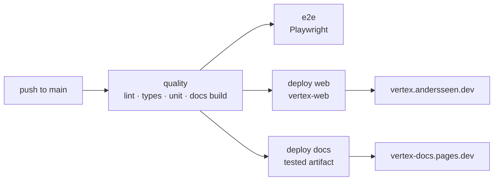

# Deployment

Vertex uses one deployment platform: Cloudflare. The monorepo publishes two
independent static products to Cloudflare Pages through the same GitHub Actions
pipeline.

| Surface | Pages project | Production URL | Build output | GitHub environment |
| --- | --- | --- | --- | --- |
| Browser workbench | `vertex-web` | <https://vertex.andersseen.dev> | `apps/web/dist/client` | `production` |
| Documentation | `vertex-docs` | <https://vertex-docs.pages.dev> | `apps/docs/dist` | `documentation` |

The documentation URL can later become `docs.vertex.andersseen.dev` without
changing its build or deployment command.

## Pipeline



- `quality` runs for pushes and pull requests.
- The documentation is built once in `quality` and uploaded as the
  `vertex-docs-dist` GitHub artifact.
- `deploy-docs` downloads that exact tested artifact; it does not rebuild it.
- Production deploy jobs only run for pushes to `main` after `quality` passes.
- `workflow_dispatch` can replay the pipeline from the Actions tab.
- E2E currently reports failures without blocking deployment.

The pipeline is
[`.github/workflows/ci.yml`](../.github/workflows/ci.yml).

## One-time Cloudflare setup

The Direct Upload Pages projects must exist before their first non-interactive
CI deployment.

```bash
bunx wrangler login
bunx wrangler pages project create vertex-docs --production-branch main
```

The existing web project remains `vertex-web`.

Cloudflare serves a Pages project at `<PROJECT>.pages.dev`, so the initial docs
URL is `https://vertex-docs.pages.dev`.

## GitHub secrets

Set these repository secrets in **Settings → Secrets and variables → Actions**:

| Secret | Required value |
| --- | --- |
| `CLOUDFLARE_API_TOKEN` | Account API token with `Cloudflare Pages: Edit` |
| `CLOUDFLARE_ACCOUNT_ID` | Cloudflare account ID that owns both Pages projects |

The same narrowly scoped credentials deploy both static sites. Project names,
branches, and output directories are normal workflow configuration and are not
secrets.

## Wrangler

Wrangler is centralized as a root development dependency. CI pins the exact
same version through `WRANGLER_VERSION`.

The docs configuration is
[`apps/docs/wrangler.jsonc`](../apps/docs/wrangler.jsonc):

```jsonc
{
  "name": "vertex-docs",
  "pages_build_output_dir": "./dist",
  "compatibility_date": "2026-07-27"
}
```

CI uses Direct Upload:

```bash
wrangler pages deploy dist --project-name=vertex-docs --branch=main
```

## Local deployment

Authenticate once:

```bash
bunx wrangler login
```

Then deploy either surface:

```bash
bun web:deploy
bun docs:deploy
```

`bun docs:deploy` builds the web-editor bundles, builds Starlight, and uploads
`apps/docs/dist`.

## Custom docs domain

After the first successful deployment:

1. Open `Workers & Pages → vertex-docs → Custom domains`.
2. Add `docs.vertex.andersseen.dev`.
3. Let Cloudflare create or validate the DNS record.
4. Change `site` in `apps/docs/astro.config.mjs`.
5. Change `DOCS_PRODUCTION_URL` and the `documentation` environment URL in CI.

The `site` value controls canonical URLs and the generated sitemap, so it must
match the real production hostname.

## Web workbench headers

The browser workbench requires cross-origin isolation for WebContainers:

- [`apps/web/public/_headers`](../apps/web/public/_headers)
- [`apps/web/public/_redirects`](../apps/web/public/_redirects)

These files are copied to `dist/client` and interpreted by Cloudflare Pages.
The documentation does not require those headers.

## Other artifacts

| Artifact | Distribution |
| --- | --- |
| `@vertex/web-editor` bundles | GitHub Release `web-editor-latest` |
| Desktop application | Local Tauri build; CI release is not wired yet |
| Backend sidecars | Local/installed development only |
