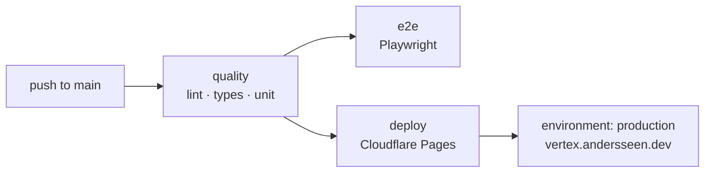

# Deployment

Vertex has **one deploy target: Cloudflare**. There is no Vercel, Netlify or GitHub Pages
path — a single axis keeps the pipeline, the docs and the GitHub *Deployments* tab honest.

| | |
| --- | --- |
| **Platform** | Cloudflare Pages |
| **Project** | `vertex-web` |
| **Production URL** | <https://vertex.andersseen.dev> |
| **Build output** | `apps/web/dist/client` (static, prerendered by Analog/Vite) |
| **Config** | [`apps/web/wrangler.toml`](../apps/web/wrangler.toml) |
| **Pipeline** | [`.github/workflows/ci.yml`](../.github/workflows/ci.yml) → job `deploy` |
| **GitHub environment** | `production` |

---

## The pipeline



* `quality` runs on every push **and** every pull request.
* `e2e` is `continue-on-error` — it reports, it does not block the release.
* `deploy` only runs for pushes to `main`, and only after `quality` is green.
* The job declares `environment: production`, so GitHub records a real deployment
  pointing at the production domain (not at the throwaway `*.pages.dev` build alias).
  The build alias is still printed in the job summary for debugging.

Every deploy is fully replayable from the Actions tab via **Run workflow**
(`workflow_dispatch`), which redeploys the current `main`.

---

## Required secrets

Set these once in **Settings → Secrets and variables → Actions**:

| Secret | Where to get it |
| --- | --- |
| `CLOUDFLARE_API_TOKEN` | Cloudflare dashboard → My Profile → API Tokens → *Edit Cloudflare Workers* template, scoped to the account below. Needs `Cloudflare Pages: Edit`. |
| `CLOUDFLARE_ACCOUNT_ID` | Cloudflare dashboard → Workers & Pages → account ID in the right sidebar. |

Nothing else is needed — the Pages project name and the output directory live in
`wrangler.toml` and in the workflow `env` block, not in secrets.

---

## Deploying from your machine

Same command shape as CI, so local and remote can never drift:

```bash
bun run deploy       # = bun run web:deploy = vite build + wrangler pages deploy
```

You need `wrangler login` (or `CLOUDFLARE_API_TOKEN` exported) first. The wrangler
version used by CI is pinned in `ci.yml` (`WRANGLER_VERSION`) and must match the
`wrangler` devDependency in `apps/web/package.json`.

---

## Static asset headers

Cross-origin isolation is required for WebContainers (`SharedArrayBuffer`). It is served
from Pages via:

* [`apps/web/public/_headers`](../apps/web/public/_headers) — `Cross-Origin-Opener-Policy`
  and `Cross-Origin-Embedder-Policy`
* [`apps/web/public/_redirects`](../apps/web/public/_redirects) — SPA fallback

Both files are copied verbatim into `dist/client` by Vite and are read natively by
Cloudflare Pages. If the preview panel stops working after a deploy, check these first.

---

## What is *not* deployed here

| Artifact | How it ships |
| --- | --- |
| `@vertex/web-editor` bundles | GitHub Release `web-editor-latest`, built by [`release-web-editor.yml`](../.github/workflows/release-web-editor.yml) |
| Desktop app (Tauri) | Built locally with `bun desktop:build`; no CI release job yet |
| Backend sidecars | Dev-only, run on the developer machine |

---

## Roadmap note

Cloudflare is steering new static projects towards **Workers with static assets** rather
than Pages. Vertex stays on Pages while the custom domain and the current project are
attached to it; migrating is a config change (`assets` binding in `wrangler.toml` plus
`wrangler deploy`) and a DNS re-point, tracked as a future task. The deploy surface stays
Cloudflare either way.
